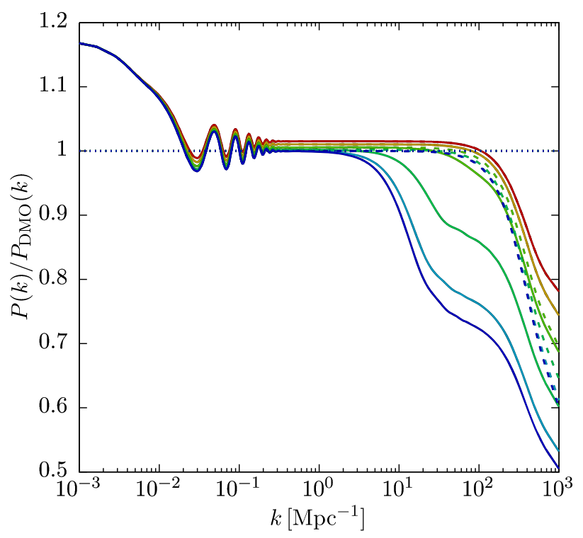
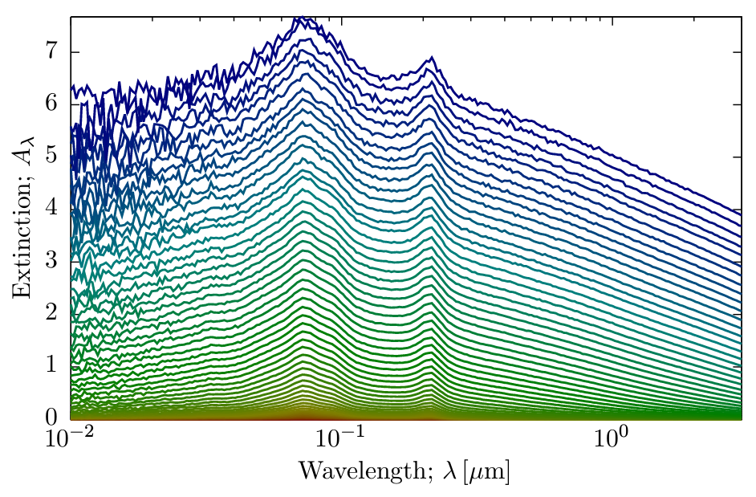
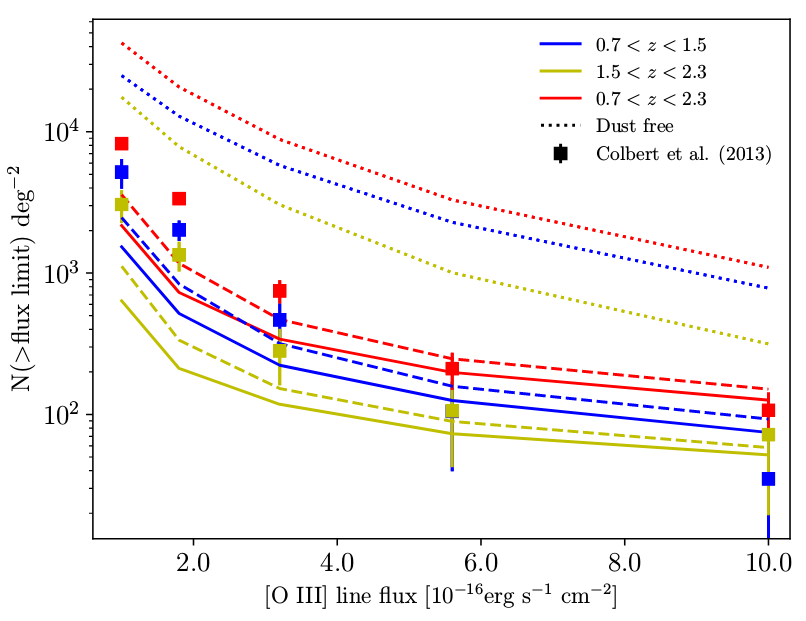

I am a Staff Scientist at the Observatories of the Carnegie Institution for Science. My research program is focused on
understanding the nature of dark matter and the process of galaxy formation, with a particular emphasis on formlating a coherent
picture of the many different aspects of these problems. I have developed a model of dark matter and galaxy formation physics,
[_Galacticus_](https://github.com/galacticusorg/galacticus/wiki), which is available to the community as an open source
project. The approach blends both analytic understanding and significant number-crunching utilizing in-house and external compute
clusters.

You can find a list of all of my publications [here](https://ui.adsabs.harvard.edu/user/libraries/YpLS0CLeQdSxHJbiIl1bQA).

# Research

You can learn more about current and former members of my research team [here](./team.html).

## Dark Matter

### Constraining the Particle Mass of Warm Dark Matter

 

A model realization of the gravitational lensing convergence field around the observed gravitational quad-lens system WFI
2033-4723. Tens of millions of such realizations were generated to quantify how frequently different masses of warm dark matter
particle would produce gravitational lensing magnifications similar to those observed. From [Gilman, AJB, et al. (2020, MNRAS,
491, 6077)](https://ui.adsabs.harvard.edu/abs/2020MNRAS.491.6077G/abstract).

### Suppresion of Dark Matter Halo Growth by Baryons

 

The power spectrum of matter in a universe containing both baryons and dark matter, relative to that in a pure dark matter
universe.  These calculations are being used to quantify how baryons reduce the number of low mass dark matter halos that form - a
crucial input to observational programs which aim to measure the nature of dark matter. From [Benson (2020, MNRAS, 493,
1268)](https://ui.adsabs.harvard.edu/abs/2020MNRAS.493.1268B/abstract).

## Galaxies

### Dust Extinction Curves for Galaxies

 

The extinction as a function of wavelength caused by dust in a suite of model galaxies. Understanding how dust absorbs starlight
is an input ingredient in the construction of simulated surveys for future telescopes. The extinction curves shown were computed
using a Monte Carlo radiative transfer code. From [Benson (2018, RNAAS, 2,
188)](https://ui.adsabs.harvard.edu/abs/2018RNAAS...2..188B/abstract).

### Emission Line Galaxy Survey Predictions for the Roman Space Telescope

 

Predictions for the number of \[O II\] emission line galaxies from the [_Galacticus_](https://github.com/galacticusorg/galacticus/wiki) model compared with observational data. [_Galacticus_](https://github.com/galacticusorg/galacticus/wiki) is being used to build synthetic surveys of emission line galaxies for the [Roman Space Telescope](https://roman.gsfc.nasa.gov/). From [Zhai, AJB, et al. (2019; MNRAS; 490; 3667)](https://ui.adsabs.harvard.edu/abs/2019MNRAS.490.3667Z/abstract).

