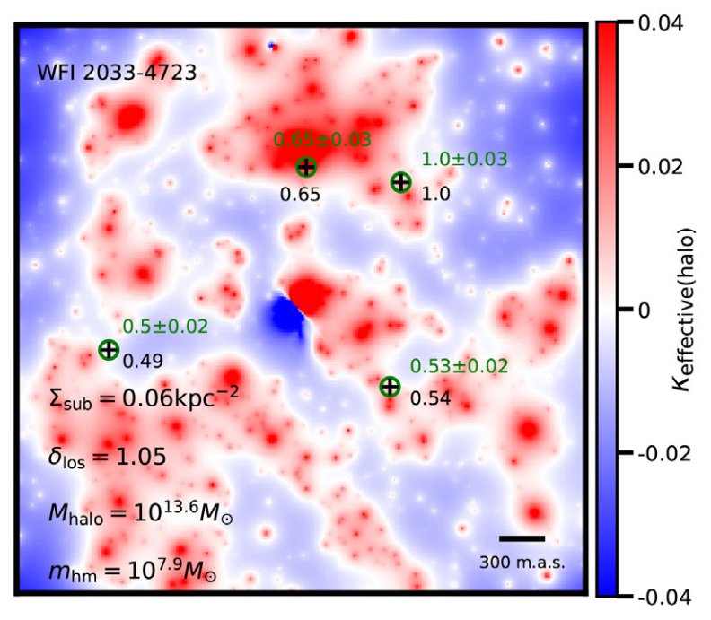

I am a Staff Scientist at the Observatories of the Carnegie Institution for Science. My research program is focused on
understanding the nature of dark matter and the process of galaxy formation, with a particular emphasis on formlating a coherent
picture of the many different aspects of these problems. I have developed a model of dark matter and galaxy formation physics,
[_Galacticus_](https://github.com/galacticusorg/galacticus/wiki), which is available to the community as an open source
project. The approach blends both analytic understanding and significant number-crunching utilizing in-house and external compute
clusters.

You can find a list of all of my publications [here](https://ui.adsabs.harvard.edu/user/libraries/YpLS0CLeQdSxHJbiIl1bQA).

# Research

You can learn more about current and former members of my research team [here](./team.html).

## Dark Matter

### Galaxies
